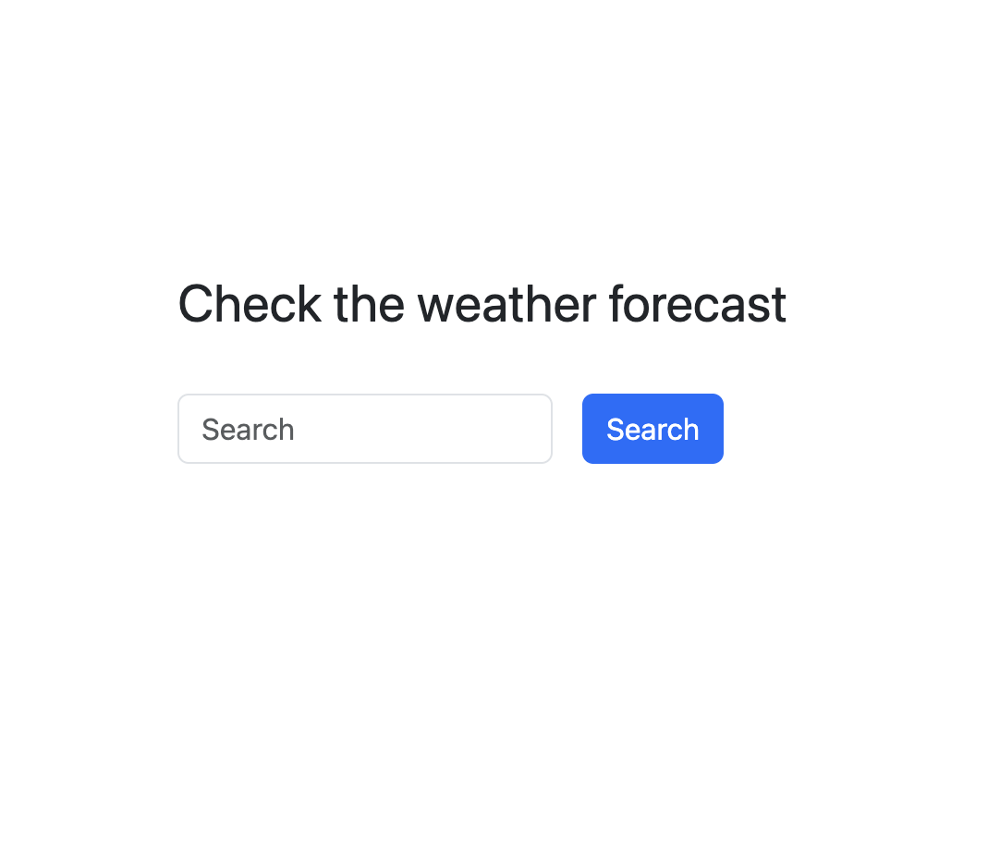
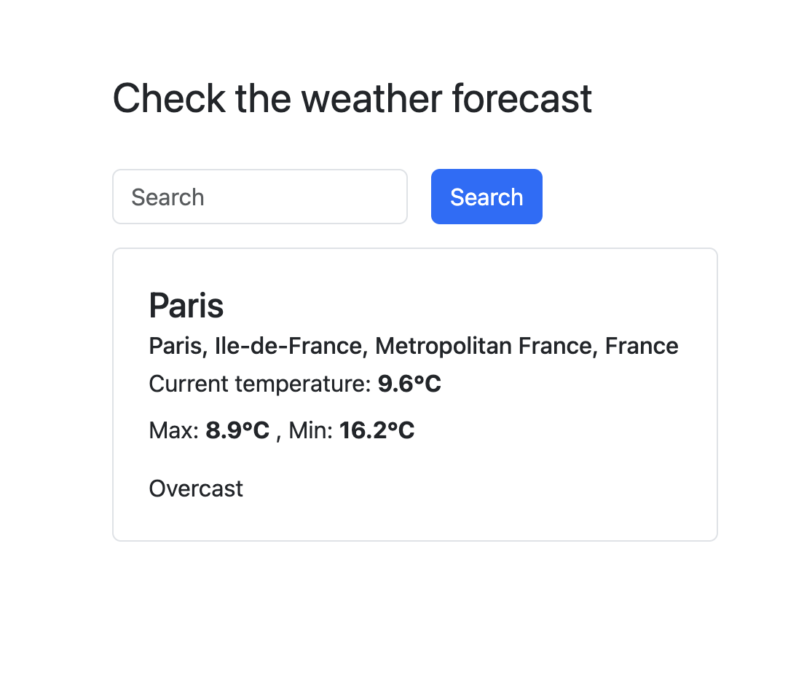
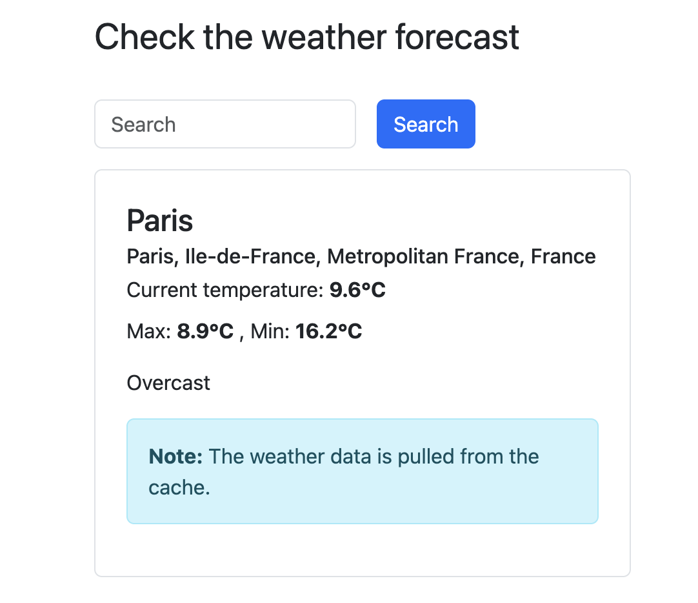
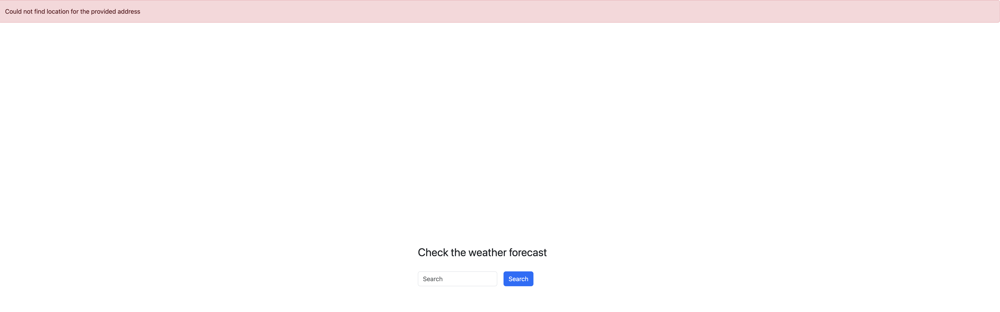

# Weather Forecast Application

A Ruby on Rails application that provides weather forecasts using OpenMeteo API and geocoding services.

## Features

- **Address-based Weather Lookup**: Enter any address to get weather information
- **Geocoding Integration**: Uses Geocoder gem for address-to-coordinates conversion
- **Weather Data Caching**: Implements 30-minute caching to reduce API calls
- **Error Handling**: Comprehensive error handling for geocoding and weather services
- **Responsive Design**: Works well on both desktop and mobile devices

## Screenshots

### Main Search Page

*The main search page where users can enter an address to get weather information*

### Weather Results

*Display of weather information for the searched location*

## Cached Weather Results

*Display of cached weather information for the searched location*

### Error Handling

*Example of error handling when location cannot be found*

## Architecture

The application follows a service-oriented architecture with the following components:

- **GeocoderWrapper**: Handles all geocoding operations with error handling
- **GeocodingService**: Provides a clean interface for accessing geocoding data
- **WeatherService**: Manages weather data retrieval and caching
- **OpenMeteoService**: Handles communication with the OpenMeteo API

## Prerequisites

- Ruby 3.1.0 or higher (Ruby 3.3 recommended)
- Rails 7.0 or higher

## Installation

1. Clone the repository:
   ```bash
   git clone https://github.com/alexeyromanov365/weather_forecast.git
   cd weather_forecast
   ```

2. Install dependencies:
   ```bash
   bundle install
   ```

3. Start the server:
   ```bash
   rails s
   ```

4. Visit `http://localhost:3000` in your browser

## API Documentation

### Weather Search

#### GET /
- **Description**: Displays the weather search form
- **Response**: HTML page with search interface

#### POST /weather
- **Description**: Get weather data for specified address
- **Parameters**:
  ```json
  {
    "address": "string (required)"
  }
  ```
- **Response**: JSON object containing weather data

## Error Handling

The application implements comprehensive error handling:

- **Geocoding Errors**: Handles service unavailability and invalid addresses
- **Weather API Errors**: Manages API timeouts and invalid responses
- **User Feedback**: Provides clear error messages to users

## Contributing

1. Fork the repository
2. Create your feature branch (`git checkout -b feature/amazing-feature`)
3. Commit your changes (`git commit -m 'Add some amazing feature'`)
4. Push to the branch (`git push origin feature/amazing-feature`)
5. Open a Pull Request

## License

No license

## Support

For support, please open an issue in the GitHub repository or contact the maintainers.
